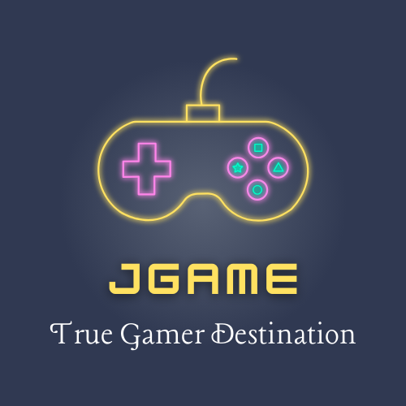

<h1 align="center">
   
JGame - Java OOP Project </h1>

This project, developed by Nguyễn Thành Vinh for the VKU Java OOP course, is a Java-based Object-Oriented Programming (OOP) system for managing a gaming platform named "JGame."

## Features

- **Game Management:** Add, remove, and update game information.
- **User Interaction:** User registration, login, and interaction with the gaming platform.
- **Buy Games:** Users can buy games from the platform.
- **Game Library:** Users can view their game library.
- **Persistence:** Utilize data storage for maintaining user and game information.
- **GUI (Graphical User Interface):** User-friendly interface for a better user experience.

## Using IntelliJ IDEA

To work on this project using IntelliJ IDEA:

1. **Clone this Repository**

   - git clone https://github.com/pho-veteran/JGame.git
     
2. **Open IntelliJ IDEA:**

   - Open IntelliJ IDEA.
   - Select "File" > "Open" and navigate to the project directory.

3. **Build and Run:**

   - Build the project using the IntelliJ build tools.
   - Run the `runFile` class

## Contact

- **Author: Nguyễn Thành Vinh**
    - GitHub: [https://github.com/pho-veteran](https://github.com/pho-veteran)
    - Email: vinhnt.23it@vku.udn.vn
